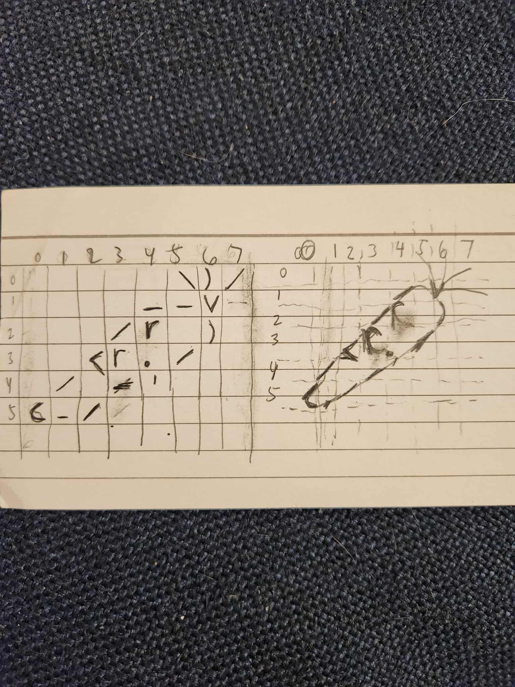

# scroll-art

## 1. Triangle Hall

`ScrollArtV1Pattern.java` is a program that prints straight lines moving either left or right. 
Then a new line, at random intervals, branches off an existing line in the opposite direction. 
It creates a pattern that looks like a bunch of triangles. 


## 2. Text-moji Art 

My text-moji art is in `ScrollArtV1.java`.
I was inspired by the bunny textmoji from a Google search of "bunny ascii emoticon": 
![](data:image/jpeg;base64,/9j/4AAQSkZJRgABAQAAAQABAAD/2wCEAAkGBw8NDQ0NDQ0PDQ0NEA8NDQ0NDw8NDQ0NFRUWFhURFRUYHSggGBolHRUVITEhJSkrLi4uFx8/ODUtNygtLisBCgoKDQ0NDw0NDysZFRkuKy0rKy03LSsrKysrNystKysrKysrKysrKysrKysrKysrKysrKysrKysrKysrKysrK//AABEIAQMAwgMBIgACEQEDEQH/xAAbAAEBAAIDAQAAAAAAAAAAAAAAAQQGAgMHBf/EADwQAAICAQIDBAkCAwYHAAAAAAABAgMEBREGEiETFDFRByIyQWFygaGxFXEzQpEjJFJjgsElVWKFoqTS/8QAFgEBAQEAAAAAAAAAAAAAAAAAAAEC/8QAFhEBAQEAAAAAAAAAAAAAAAAAABEB/9oADAMBAAIRAxEAPwD18AGFUEKAAAAAAAAAAAAAoAAAAAAAAFAAAhSANwABxKQAUAAAAAAAAFAEAAFAAAAACkAAABFBAAAAUAAHEAACkKAAAAAAUEKBCkKAAAAAAAAECkKAAAVAAEAABxAAUKQBFAAUAAAAAUAAAAAAAAABAAACkAAABQAAcQAAAAR30UqUd234tdNjs7tHzf2OOB7D+aX5Mk1B0d2j5v7Du0fN/Y+HxtxLLTKsZU0rIy83Jqw8WiUnCMrJvrKTSbUUvF7e9GHqHEuRi8QYenXRr7jqOPN41ii1ZHMr3coOW+zXLt7vGcSwbR3aPm/sO7R839jvNc1LiWUNXwtJoqVtl9VuVl2Sk0sXFj0jLZL1nKXq+PTp5kg+73Zeb+w7tHzf2NW4W4mvv1XV9KzVVG3CnG7Edace1wZ9Ytpt7uPNDdr3y+Bt4g6e7Lzf2Hdl5v7HcBB092Xm/sO7Lzf2O4CDp7svN/Yd2Xm/sdwEHT3Zeb+xHjrzf2O8kvBiDAABkAAFAABxBCoACgDIwPYfzS/JkmLp3sP55/kyjaPONafe+MtLx31r07BvzUv821yr/wBq39DL9MmnWT0yGfjr+96RfVqFL23fLBrnT+CW0n8hhWPseOYc3TvWkuNfxlGbbS+lbZ6Jk0QtrsqsipV2xlXOL8JQktmn9GB0aPqMMzFx8ur+Hk1V3Q81GcU9n8VvsaH6P5974h4mzpdextp06lvrywq5ozivJN1wf1Oz0PXzx6tQ0S6Tduj5U66+bo54lrcq5/Hd87+ClE6PRRvVqnFONJbTjqLvXxrtla4v+iT+oHL0gf8ADNb0XW16tNknpWe99l2Vm7rk/gm5yb/6InpJr3H+hfqek5uGlvZOpzo9394h69fX3byil+zZ0ejTXv1PRsLJlLmtVfYZDe3N29fqSk9v8Wyl/qQG0AAAAAAAAEl4MpJeDAwAAYAABQEKBwKgAKCFA79O9h/PP8mUYunew/nn+TKN4jQ/SRpl0crR9YxKp3W6dlKu+uqDnZPCv2hY0l1bXX9udv3G+AAaNnaJk4/E+NqeLS54udjTxNScXFdnOC3rtkm+u/LXHonsoPzOq3TbsHiqGbVTbZiaxjPHypVwlOFGXSk4WT2XqpxjGKfm5G/AAaPwVouTpuq61R2L/TMuyOfiXJw5I3z/AItW2+6e/h08K15m8AAAAAAAAAASXgykl4MDAABhQAAAABxAAAAAZGm+w/nn+TKMXTfYfzz/ACZRrEaxx3xJbp9eJViQrtztQyqsTFhapSrjzP17ZqLTcYrx2f8AMjZ0ecaq3lcaadTJ716dp92XGP8AnWuVbf8AR1/0PRygAAAAA1PgDimzUo51GVGqGdp2VbiZMKVKNckpNQsjGUm0nyyXVvrFm2HmemQeFxtm1Re1eqYEMpw93awajv8A+Fj/ANTPTAAAAAAASXgykl4MDAABhQAAAABxAAAAAZGm+w/nn+TKMXTfYfzz/JlG8R5re+w45p5uizNKlCtvwlOM5ScV8dqmz0o0b0kaTe7tK1bCpnfkaXkp201Lmttwrdo2qK/mkkui8pSN5QGva9wfj6hcr7r82uSgq+XHy7qK9k29+WL236+Jk2W4ui6e53X2QxMSPrXZFluTalKWy3k95SfNJJL4pI+wY2oYNOVTPHyaoXU2LayqyKlCS33W6/dJ/QD52Zi42tYNMo3X92vVeRVbjXXYtkotPl3cdnts/Zl7/duhw7wzRpvaui3Ks7Xl5u85N2Qly77cqk9l4n1MTGrorrpphGuqqKhXXBKMIQS2UUvcjuA8wrtWTx3NQ6/p+mdnY/dzSalt/wCwj080H0Z6HfDI1jVsyuyq/Usuzsaro8lleHXKXJutt1vvt190Iv3m/AAAAAAAkvBlJLwYGAADCgAAAAo4gAgAADI072H88/yZRi6d7D+ef5Mo3iAAAAAAD4HHfES0nTMrO2Up1x5aIS9md83ywTXvW73fwTPlcZcQZ2l8PPPkqXqFdeL2ycJOiNtk4RsSjvvsuZpdQN0Bp+o8SZVWt6Np8Y1d3z6Mi3IbjJ2KddcpLle/Rbpe5+J2arxHfh67gYVyr7hqVNsKLFFq2vOrfM4ylvs4uLil033kvIDbAfK4q1qGmafl51mzWPVKcYt7Kdj6Qhv7t5OK+p8LO13PxuGpalcqf1COKsmUFXKNMJSakoOHNvuoySfXxT/YDcgaLlcWZiu4XjGqqMNZrlPNi4yk65djXZywe/T25+O/gZ/E3EV+n6ppNc1W9O1GU8Oybi+0pzH1qfNvs1Lfbbbps3uBtZH4MpJeDAwAAYUAAAAFHEAEApCgd+m+w/nn+TKMbT16j+aX5Mk3iPO+KNf1HM1haFo11eJKmlZOoZ1laulTGXLy1wi+m+0ovzfOvDZt/M1HUtZ4bycKzUNRjq2lZd0ca+ydEMe7Gslu1JcrfuTfi0+VrZdGcv1OrRuL8+efKNGNq+NRLGyrPVqVlUYQcJS8F1jLq309XzOPpU1jG1mODoenX15mRl5VU7ZY043wxsaG/NZKUW0mt99vJP4bh6uAAPNvSxJ353DWnNb15GorItT8HGjk3T/dWSN34j0OjU8O7CylJ0XcnPyS5J+rOM1s/d1ijRvSpvTqvC2Y/wCHXnSx7H5O51JP+kZv6HpYHy8rQqLc3Ez5KXb4Vd9VKTShy2qKk2turSi0uv8AM/Hptpnpz3p07Dz4L+107UMbJg/Dw5um/u68v9D0c839PMnLSKcWC5rc3NxseuPnJ80l94pfUB6ap9ti6Vg7vk1HUsWmzbpzU9d1/Vxf0N61rS687EyMK7mVWRVKmbrajOMZLbeO6aTXu6M0L0zpUVaHlv8Ah4WqYsrJe6MOsuZ+S/s/uelgfIu4cxp2aba1Lm0rm7rtLolKvsmpefTZ/ukav6cqN9BuvT2sw78XJqkvGFnaxrUl8drGb+aD6c71Dh3Mg/aunjVQXvcu2hPZfSDA3bTsnt6KLl4XVV2r9pRUv9zvl4MxNHxnRi41L8aaaqn+8YKP+xly8GBgAAwoAAgACq4ghSAAAMnA9h/NL8mSdGGtofVneaxGFq2kY2dX2WZjVZNafMoXQjYoy/xLfwfxRj6Jw3g6fzdyw6cZzW05VQSnJeTl4tfDc+qCjVNb45rwsizHlpmrZDr5d7cXBlbRPdJ+rPdc3jt+6ZgL0mVf8m11f9uf/wBG9ADTePdGlruhyVFdleS415uHC6PYX15EOqg1Jrkm05Q6vo5Gy6Lfdbi49mTU6MidVcr6W0+zu5Vzx3XRrfczQANJ4i0TI1DXtLlOprTdLhPNla3HlvzW9q61HffePLGW+23ivI3YAfA480D9V0rMwlt2ltfNQ29ksiDU6937lzJJ/BsyOErMmenYbzqpUZaqjDIrm4Sl2sPVct4tr1tubx/mPrgAaVxtomRqeo6Pj9k/03Eueo5lzcOWdtfSmlLfdt+tv08J+PQ3UACS8GUkvBgYAAMgACAAUo6ynFFIqgACp/EbvzYAF3fmxu/NkAF3fmxu/NkAF3fmN35kKA3fmy7vzZABd35jd+bIAi7vzG782QAXmfmN35sgChCkKBQCIAAo60UhSKFAApCkAoAAAAAUhQAAAAAAAAgAAABCqAAgAAo4lOJTIFAApAABSACgIFApCgAAAAAAABAAACFIwoAAgAAOBSFI0AAIFIAKQACoNkAFBABQAEAAAAAUAAApAUUgARSABXFFAIoAAgAAKQAAAAAAAoAAAgAoAAAAAACgCAAAAP/Z)
It was only 8x3 so I added a rocket detailing to it. 

I decided to make a 8x6 carrot after I made this bunny rocket. Here is the carrot: 
```
     \)/
    --v 
   /r )
  >r./
 / '  
c_/   
```

#### Process 
This carrot came from my head. I wrote out the carrot on paper first. On the right is the carrot, and then I made a grid to fit it. 




Then I input each individual character into its 2D location into Image.java, in the `getImage()` function. 
